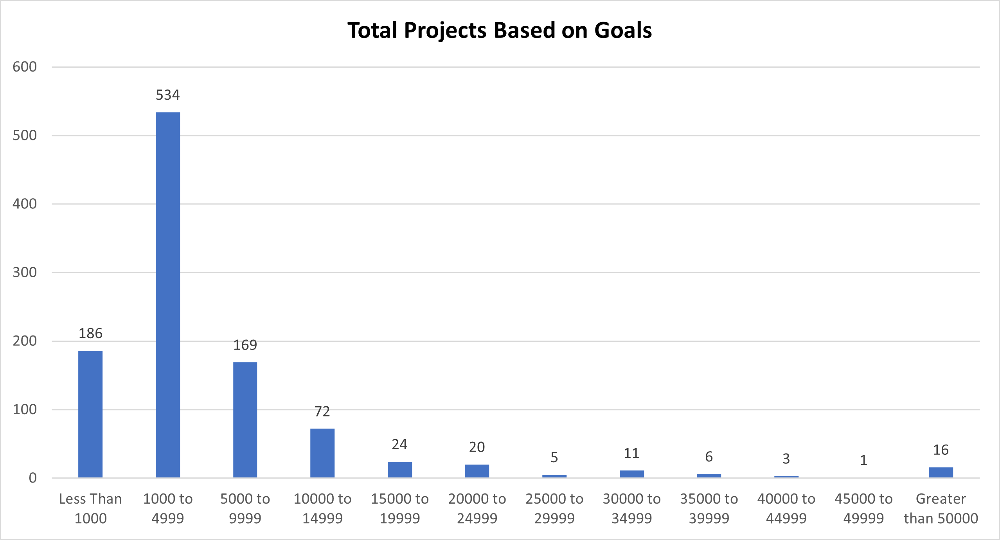

# Kickstarting with Excel (Kickstarter Challenge)

## Overview of Project

**Purpose:**  
Louise is an up and coming playwrite wanting to start a crowdfunding campaign to fund her play, _Fever_. The purpose of this analysis is to assist Louise with her crowdfunding project to determine if there are specific factors that would help make her project successful. By using Excel, we can create a visual representation of insights to be presented to Louise on our findings.

## Analysis and Challenges

**Analysis of Outcomes Based on Launch Date:**  
We want to know how launch dates in different months can impact successfulness of plays. We first sorted the data into different months on when plays were launched, then separated them into "successful", "failed", or canceled" categories by using pivot tables. From there we can create a visual representation of the data using a line graph to give us a better illistration of our findings.  

**Analysis of Outcomes Based on Goals:**  
We want to know how different ranges of fundraising goals can impact the sucessfulness of plays. First, we sorted the data into different categories based on the fundraising goal amount. Then we separated them into "successful", "failed", or canceled" categories within the parameters of the fundraising goal amount categories. From there we calculated the percentage of "successful", "failed", or canceled." Lastly, we provided a line graph of the percentage of the results based on the fundraising goals categories. (Codes used in this section are located at the end)  

**Challenges and Difficulties Encountered:**  
I think the biggest challenge for me with this project is telling the story of the analysis that is performed. Story telling has to be clear and exciting so all information are passed from the presenter to the listeners. If the information isn't clear, then the listeners would get lost or confused on the presentation. If the presentation isn't exciting, then people would lose interest and daydream about other things. To combat these challenges, I like to keep things short and to the point. Using Excel and writing functions are pretty easy when you know which formulas to use and how to pass parameters for each function. When you mess up a function or are unsure of the parameters, then it can get frustrating and annoying to debug the issues. Another thing that I just thought of that was difficult for me is spelling when using a ".md" file because there isn't a spellcheck feature. As well as the long scrolling for the longer paragraphs.

## Results

- What are two conclusions you can draw about the Outcomes based on Launch Date?  
According to our analysis, we can see that the most successful months to launch a play are in the months of May and June. This information is helpful to Louise because of the time of year she chooses to launch her play would give her a higher chance of success or a higher chance to fail. Another conclusion we can draw from our analysis is that after the highest successful month, May, the general tread of successful plays decreases for the rest of the year.

- What can you conclude about the Outcomes based on Goals?  
According to our analysis, we can see the rate of success for reaching the fundraising goal based on the goal amount are more successful when the goal amount is lower vs if the goal amount is higher. It is also important to note that, even though goals ranging from $35000 to $44999 show a higher or greater than 50% success rate, the total number of projects within that range are lower compared to the total number of projects at a lower fundraising goal. Having a higher sample size within each goals range can give you a better representation of the outcome. This information is helpful to Louise because her goal for her play is greater than $10000 at this time. If she is able to decrease the cost and fundraising goal, she would have a greater success in achieving the fundraising goal.  

- What are some limitations of this dataset?  
Limitation of this dataset includes the years range. Currently, we are in 2021 almost 2022, but the range of the years goes from 2009 to 2017. This dataset does not give us the most recent 4 years of results of the industry. Using plays as an example for another limitation, plays has a variety of genre including comedy or tragedy but our dataset does not separate these differences.

- What are some other possible tables and/or graphs that we could create?  
Other tables and/or graphs we could create could see how much was pledged per backers for a specific parent category and/or subcategory to see what people are interested in supporting. Or compare and contrasting differences between 2 other entertainment categories like music and film.  

### Codes Used
